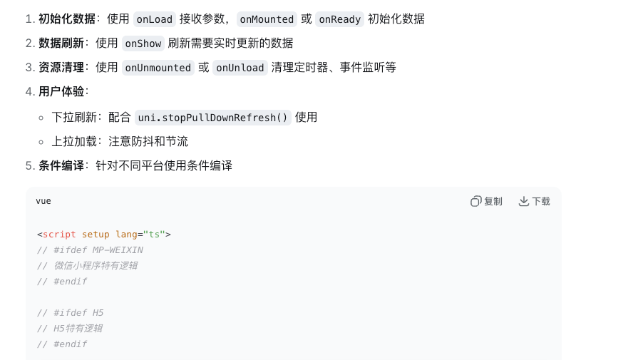

<!-- vue的 -->

<!-- uniapp独有的 -->

完整的生命周期执行顺序
进入页面：
1. onLoad(options)           ← 最先执行，接收页面参数
2. onShow()                 ← 页面显示
3. onBeforeMount()          ← Vue组件挂载前
4. onMounted()              ← Vue组件挂载完成
5. onReady()                ← 页面初次渲染完成

离开页面（通过navigateTo跳转）：
1. onHide()                 ← 页面隐藏
2. onBeforeUnmount()        ← Vue组件卸载前
3. onUnmounted()            ← Vue组件卸载完成
4. onUnload()               ← 页面卸载

返回页面（通过navigateBack返回）：
1. onShow()                 ← 页面重新显示
2. onActivated()            ← 如果使用keep-alive缓存

下拉刷新：
1. onPullDownRefresh()      ← 触发下拉刷新

上拉触底：
1. onReachBottom()          ← 页面滚动到底部
